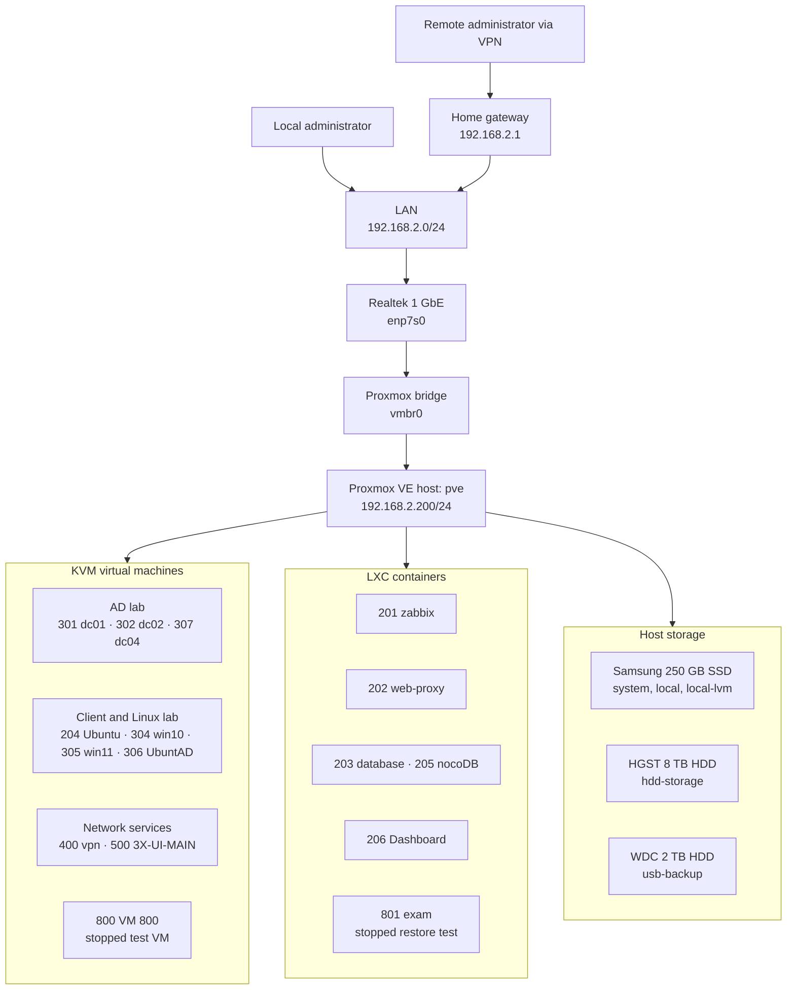

# Infrastructure Scheme

The homelab is built around one Proxmox VE host. KVM virtual machines provide Windows, Linux, VPN, and application workloads; LXC containers provide monitoring, proxy, database, and internal services.

## Logical architecture

## Layers

1. **Physical layer:** the X79 server, Realtek NIC, system SSD, main HDD, and separate backup HDD.
2. **Virtualization layer:** Debian 13 and Proxmox VE 9.2.0 using KVM for VMs and LXC for containers.
3. **Network layer:** `enp7s0` is attached to `vmbr0`, which connects the host and guests to `192.168.2.0/24`.
4. **Service layer:** Active Directory, Linux labs, local web services, monitoring, databases, dashboard, VPN, and Xray management.
5. **Recovery layer:** backups are stored separately from the system disk and are validated through restore testing.

## Access model

Home services are intended to be reached from the local network or through VPN access. The documentation does not publish an external address, expose services directly, or include credential-bearing VPN configuration.

See [Network Map](network-map.md) for local DNS names and [VM and LXC Inventory](vm-lxc-inventory.md) for the workload list.
