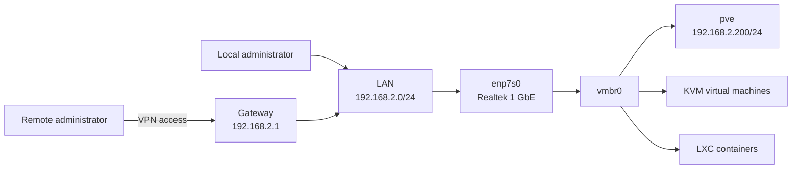

# Network Map

## LAN and host networking

| Item | Value |
|---|---|
| LAN | `192.168.2.0/24` |
| Default gateway | `192.168.2.1` |
| Proxmox host | `192.168.2.200/24` |
| Hostname | `pve` |
| Physical interface | `enp7s0` |
| Linux bridge | `vmbr0` |
| Ethernet controller | Realtek RTL8111/8168/8211 PCIe Gigabit Ethernet |

`enp7s0` provides the physical LAN connection. Proxmox bridge `vmbr0` connects the host and its virtual workloads to the same home-lab network.

## Local DNS and service names

Only the Proxmox host address is confirmed. Other guest addresses are deliberately not inferred.

| DNS name | Service / destination | Confirmed address |
|---|---|---|
| `pve.lan` | Proxmox host | `192.168.2.200` |
| `zabbix.lan` | Monitoring | Not documented |
| `site1.lan` | Local Nginx website via web proxy | Not documented |
| `site2.lan` | Local Nginx website via web proxy | Not documented |
| `site3.lan` | Local Nginx website via web proxy | Not documented |
| `files.lan` | File services | Not documented |

## Access boundary

- Home services are intended for the LAN or authenticated VPN access.
- No public domain or external IP address is documented here.
- This repository must not contain VPN credentials, private keys, access tokens, QR codes, or firewall exports containing secrets.
- Public exposure, port-forwarding state, VLANs, and per-guest firewall rules are not claimed because they were not confirmed in the inventory.

## Follow-up documentation

- Record confirmed guest addresses or DHCP reservations in a sanitized table.
- Document DNS ownership and update workflow.
- Document firewall zones and allowed flows without publishing secrets.
- Add a network diagram screenshot only after removing sensitive external details.
